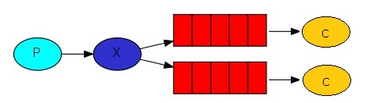
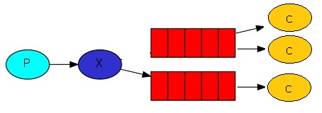

# AppWithRabbitMQ

Вариант №1

 
В данном проекте нужно:
1) Запустить двух потребителей - Consumer1 и Consumer2
2) Запустить производителя сообщений - ProducerWithExchange. Сообщения вводятся в консоль.

Вариант №2

1) Нужно запустить трёх потребителей - NewConsumer1, NewConsumer2 и NewConsumer3
2) Запустить производителя сообщений - ProducerWithExchange. Сообщения вводятся в консоль.
